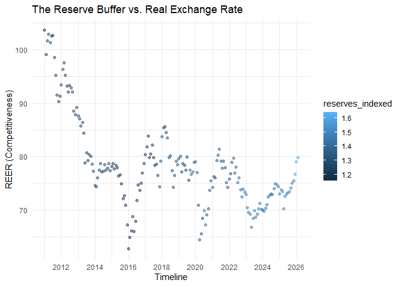
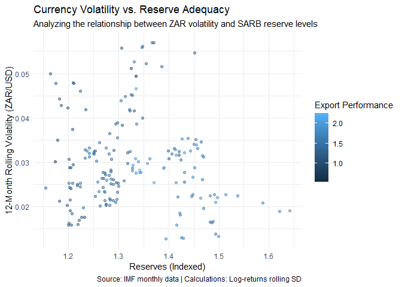

# Purpose

Purpose of this work folder is to analyse South African export data and
the relationship between exports, foreign reserves and the Exchange rate
.

``` r
rm(list = ls()) # Clean your environment:
gc() # garbage collection - It can be useful to call gc after a large object has been removed, as this may prompt R to return memory to the operating system.
```

    ##           used (Mb) gc trigger (Mb) max used (Mb)
    ## Ncells  559959 30.0    1248845 66.7   702074 37.5
    ## Vcells 1060808  8.1    8388608 64.0  1927950 14.8

``` r
library(tidyverse)
```

    ## Warning: package 'readr' was built under R version 4.5.3

    ## Warning: package 'purrr' was built under R version 4.5.3

    ## Warning: package 'dplyr' was built under R version 4.5.3

    ## ── Attaching core tidyverse packages ──────────────────────── tidyverse 2.0.0 ──
    ## ✔ dplyr     1.2.1     ✔ readr     2.2.0
    ## ✔ forcats   1.0.1     ✔ stringr   1.6.0
    ## ✔ ggplot2   4.0.2     ✔ tibble    3.3.1
    ## ✔ lubridate 1.9.5     ✔ tidyr     1.3.2
    ## ✔ purrr     1.2.2     
    ## ── Conflicts ────────────────────────────────────────── tidyverse_conflicts() ──
    ## ✖ dplyr::filter() masks stats::filter()
    ## ✖ dplyr::lag()    masks stats::lag()
    ## ℹ Use the conflicted package (<http://conflicted.r-lib.org/>) to force all conflicts to become errors

``` r
list.files('code/', full.names = T, recursive = T) %>% .[grepl('.R', .)] %>% as.list() %>% walk(~source(.))
```

    ## 
    ## Attaching package: 'zoo'
    ## 
    ## The following objects are masked from 'package:base':
    ## 
    ##     as.Date, as.Date.numeric

``` r
# Loading libraries
pacman::p_load(tidyverse, RColorBrewer,zoo,imfapi)
```

# 1. Data Importing

## 1.1 SA exports

``` r
sa_exports <- imf_get(
    dataflow_id = "IMTS",
    dimensions = list(
        FREQUENCY = "M",             # Monthly
        COUNTRY = "ZAF",             # South Africa
        COUNTERPART_COUNTRY = "",    # "" is World (Total Exports per country), while "G001" is aggregate
        INDICATOR = "XG_FOB_USD"     # Exports, Goods, US Dollars
    ),
    start_period = "2010-Q1"       # No end period, that the data is pulled up till most recent period
)

head(sa_exports)
```

    ## # A tibble: 6 × 6
    ##   COUNTRY INDICATOR  COUNTERPART_COUNTRY FREQUENCY TIME_PERIOD OBS_VALUE
    ##   <chr>   <chr>      <chr>               <chr>     <chr>           <dbl>
    ## 1 ZAF     XG_FOB_USD ABW                 M         2010-M03          945
    ## 2 ZAF     XG_FOB_USD ABW                 M         2010-M04          952
    ## 3 ZAF     XG_FOB_USD ABW                 M         2010-M05         1400
    ## 4 ZAF     XG_FOB_USD ABW                 M         2010-M06        18910
    ## 5 ZAF     XG_FOB_USD ABW                 M         2010-M08        18083
    ## 6 ZAF     XG_FOB_USD ABW                 M         2010-M09         2688

## 1.2 SA foreign reserves

``` r
sa_foreign_reserves <- imf_get(
    dataflow_id = "IL",
    dimensions = list(
        COUNTRY = "ZAF",              # South Africa
        INDICATOR = c("RXF11FX_REVS", # Reserves excluding gold, foreign exchange
                      "NFAOFA_ACO_NRES_S121", # Net foreign assets, Claims on Nonresidents, Other depository corporations
                      "NFAOFL_LT_NRES_S121",  # Net foreign assets, other foreign liabilities, Liabilities to Nonresidents, Central bank
                      "TRGMV_REVS") ,
        UNIT = "USD",                # Measurement currency
        FREQUENCY = "M"             # Monthly
    ),
    start_period = "2010-Q1"       # No end period, that the data is pulled up till most recent period
)

head(sa_foreign_reserves)
```

    ## # A tibble: 6 × 6
    ##   COUNTRY INDICATOR            UNIT  FREQUENCY TIME_PERIOD OBS_VALUE
    ##   <chr>   <chr>                <chr> <chr>     <chr>           <dbl>
    ## 1 ZAF     NFAOFA_ACO_NRES_S121 USD   M         2010-M01     9697866.
    ## 2 ZAF     NFAOFA_ACO_NRES_S121 USD   M         2010-M02     9554630.
    ## 3 ZAF     NFAOFA_ACO_NRES_S121 USD   M         2010-M03    10121073.
    ## 4 ZAF     NFAOFA_ACO_NRES_S121 USD   M         2010-M04     9806378.
    ## 5 ZAF     NFAOFA_ACO_NRES_S121 USD   M         2010-M05     9419502.
    ## 6 ZAF     NFAOFA_ACO_NRES_S121 USD   M         2010-M06     9462892.

## 1.3 EFFECTIVE EXCAHNGE RATE DATA

``` r
sa_EER <- imf_get(
    dataflow_id = "EER",
    dimensions = list(
        COUNTRY = "ZAF",                         # South Africa
        INDICATOR = c("REER_IX_RY2010_ACW_RCPI", # Real
                      "NEER_IX_RY2010_ACW"),     # Nominal
        FREQUENCY = "M"                          # Monthly
    ),
    start_period = "2010-Q1"                     # No end period, that the data is pulled up till most recent period
)

head(sa_EER)
```

    ## # A tibble: 6 × 5
    ##   COUNTRY INDICATOR          FREQUENCY TIME_PERIOD OBS_VALUE
    ##   <chr>   <chr>              <chr>     <chr>           <dbl>
    ## 1 ZAF     NEER_IX_RY2010_ACW M         2010-M01         96.2
    ## 2 ZAF     NEER_IX_RY2010_ACW M         2010-M02         95.4
    ## 3 ZAF     NEER_IX_RY2010_ACW M         2010-M03         98.5
    ## 4 ZAF     NEER_IX_RY2010_ACW M         2010-M04         99.3
    ## 5 ZAF     NEER_IX_RY2010_ACW M         2010-M05         98.4
    ## 6 ZAF     NEER_IX_RY2010_ACW M         2010-M06         99.8

## 1.4 SA_EUR_USD exchange rate data

``` r
sa_FX <- imf_get(
    dataflow_id = "ER",
    dimensions = list(
        COUNTRY = "ZAF",                         # South Africa
        INDICATOR = c("XDC_EUR",
                      "XDC_USD"),
        TYPE_OF_TRANSFORMATION = c("EOP_RT","PA_RT"),
        FREQUENCY = "M"                          # Monthly
    ),
    start_period = "2010-Q1"                     # No end period, that the data is pulled up till most recent period
)

head(sa_FX)
```

    ## # A tibble: 6 × 6
    ##   COUNTRY INDICATOR TYPE_OF_TRANSFORMATION FREQUENCY TIME_PERIOD OBS_VALUE
    ##   <chr>   <chr>     <chr>                  <chr>     <chr>           <dbl>
    ## 1 ZAF     XDC_EUR   EOP_RT                 M         2010-M01        10.6 
    ## 2 ZAF     XDC_EUR   EOP_RT                 M         2010-M02        10.5 
    ## 3 ZAF     XDC_EUR   EOP_RT                 M         2010-M03         9.89
    ## 4 ZAF     XDC_EUR   EOP_RT                 M         2010-M04         9.76
    ## 5 ZAF     XDC_EUR   EOP_RT                 M         2010-M05         9.35
    ## 6 ZAF     XDC_EUR   EOP_RT                 M         2010-M06         9.38

# 2 Data wrangling

## 2.1 sa_EER

``` r
sa_EER <- sa_EER %>% select(-FREQUENCY)
```

Just removing redundant variable

## 2.2 sa_foreign_reserves

``` r
sa_foreign_reserves <- sa_foreign_reserves %>% select(-c("FREQUENCY", "UNIT")) %>%
    spread(INDICATOR, OBS_VALUE) %>%
    rename(Reserves_excl_gold = RXF11FX_REVS) %>%
    select(COUNTRY, TIME_PERIOD, Reserves_excl_gold) %>%
    mutate(reserves_indexed = Reserves_excl_gold/32309728657) # reserves indexed to 2010
```

Chose desired variables, renamed them and indexed reserves to the
starting value of the data Jan 2010

## 2.3 sa_FX

``` r
sa_FX <- sa_FX %>%
    pivot_wider(
        names_from = c(INDICATOR, TYPE_OF_TRANSFORMATION),
        values_from = OBS_VALUE,
        names_sep = "_") %>%
    rename(ZAR_EUR_PA = XDC_EUR_PA_RT,
           ZAR_EUR_EOP = XDC_EUR_EOP_RT,
           ZAR_USD_PA = XDC_USD_PA_RT,
           ZAR_USD_EOP = XDC_USD_EOP_RT)
```

Made the data wide and renamed the variables.

## 2.4 sa_exports

``` r
# sa_exports
sa_exports <- sa_exports %>%
    # 1. Remove Frequency
    select(-FREQUENCY) %>%

    # 2. Filter out regions with numbers (using your regex)
    filter(!grepl("[0-9]", COUNTERPART_COUNTRY)) %>%

    # 3. Create the date and year columns FIRST
    mutate(date_fixed = lubridate::ym(TIME_PERIOD),
           year = lubridate::year(date_fixed)) %>%

    # 4. NOW you can safely remove the old columns
    select(-date_fixed) %>%

    # 5. Rename the indicator
    mutate(INDICATOR = "Exports_USD")


# Analysis
sa_exports_ranked <- sa_exports %>%
    # 1. Sum values for each country per year
    group_by(COUNTERPART_COUNTRY, year) %>%
    summarise(annual_exp = sum(OBS_VALUE, na.rm = TRUE), .groups = "drop") %>%

    # 2. Rank countries within each year
    group_by(year) %>%
    mutate(export_rank = rank(desc(annual_exp))) %>%
    ungroup() %>%

    # Calculating each country's percentage of total exports per year
    group_by(year) %>%
    mutate(annual_exp_perc = (annual_exp/sum(annual_exp))*100) %>%
    arrange(year, annual_exp_perc)

# aggregating exports by year and indexing
sa_exports_total <- sa_exports %>% 
    ungroup() %>%
    group_by(TIME_PERIOD) %>%
    summarise(tot_mon_exports = sum(OBS_VALUE, na.rm = T)) %>%

    # Indexed to 2010-m01
    mutate(tot_export_index = tot_mon_exports/5279270626)
```

Filtered, ranked, aggregated and indexed the data

## 2.5 Series of joins to finalise plotting data

``` r
df_final <- calc_rolling_vol(sa_FX, TIME_PERIOD, ZAR_USD_PA,12)
 df_final <- df_final %>% slice(-(1:12))
sa_foreign_reserves <- sa_foreign_reserves %>% slice(-(1:12))


scatterplot_data <- left_join(df_final,sa_foreign_reserves, by = "TIME_PERIOD")

# 1. Filter the EER data FIRST to avoid the many-to-many explosion
sa_REER_only <- sa_EER %>%
    filter("REER_IX_RY2010_ACW_RCPI" == INDICATOR)

scatterplot_data <- scatterplot_data %>%
    left_join(sa_REER_only, by = "TIME_PERIOD") %>%
    # Use everything() first to see where the column went,
    # or use this specific select that accounts for renaming:
    select(
        TIME_PERIOD,
        rolling_vol,
        reserves_indexed,
        # This picks up INDICATOR even if R renamed it to INDICATOR.y
        any_of(c("OBS_VALUE", "OBS_VALUE.y", "OBS_VALUE.x")),
        Reserves_excl_gold
    )
scatterplot_data %>%  left_join(sa_exports_total)
```

    ## Joining with `by = join_by(TIME_PERIOD)`

    ## # A tibble: 182 × 7
    ##    TIME_PERIOD rolling_vol reserves_indexed OBS_VALUE Reserves_excl_gold
    ##    <chr>             <dbl>            <dbl>     <dbl>              <dbl>
    ##  1 2011-M01         0.0243             1.16     104.        37338209174.
    ##  2 2011-M02         0.0253             1.20      99.1       38823495624.
    ##  3 2011-M03         0.0256             1.26     102.        40673983614.
    ##  4 2011-M04         0.0263             1.29     103.        41525101064.
    ##  5 2011-M05         0.0234             1.27     101.        41100956212.
    ##  6 2011-M06         0.0233             1.27     103.        41119514109.
    ##  7 2011-M07         0.0235             1.26     103.        40748596382.
    ##  8 2011-M08         0.0259             1.28      98.6       41232824156.
    ##  9 2011-M09         0.0321             1.25      95.2       40412975701.
    ## 10 2011-M10         0.0325             1.25      91.5       40422605364.
    ## # ℹ 172 more rows
    ## # ℹ 2 more variables: tot_mon_exports <dbl>, tot_export_index <dbl>

# 3. Plots

AI did give me the explanations. I will when I have time add my own
interpretation. \## Plot 1

``` r
# 1. Update the data 
scatterplot_data <- scatterplot_data %>%
    mutate(date_axis = ym(TIME_PERIOD))

# 2. Re-create the plot object using the NEW column 'date_axis'
g <- plot_scatter(scatterplot_data, x = date_axis, y = OBS_VALUE, color = reserves_indexed)

# 3. Apply the date formatting and labels
g <- g + 
    scale_x_date(date_breaks = "2 years", date_labels = "%Y") +
    labs(
        x = "Timeline", # Updated from 'Reserve Levels' because X is now a date
        y = "REER (Competitiveness)",
        title = "The Reserve Buffer vs. Real Exchange Rate"
    )

# 4. View it
g
```

 The
Competitiveness Trend: If the line (REER) is trending upward, South
Africa is becoming less competitive. It means our goods are becoming
more expensive relative to our trading partners.

The Reserve Response: Look for periods where the REER spikes and the
color (Reserves) changes significantly. If the color fades (lower
reserves) while REER is high, it suggests the SARB lacks the
“ammunition” to intervene and weaken the Rand to help exporters.

## Plot 2

``` r
scatterplot_data <- scatterplot_data %>%  left_join(sa_exports_total)
```

    ## Joining with `by = join_by(TIME_PERIOD)`

``` r
g2 <- plot_scatter(scatterplot_data, reserves_indexed, rolling_vol , color = tot_export_index)
g2 <- g2 + 
    labs(
        title = "Currency Volatility vs. Reserve Adequacy",
        subtitle = "Analyzing the relationship between ZAR volatility and SARB reserve levels",
        x = "Reserves (Indexed)",
        y = "12-Month Rolling Volatility (ZAR/USD)",
        color = "Export Performance",
        caption = "Source: IMF monthly data | Calculations: Log-returns rolling SD"
    ) +
    theme_minimal() # Optional: keeps it clean for academic printing

g2
```

 The
“Defensive Cap” Evidence: You want to see a negative slope. As you move
to the right (Higher Reserves), the points should settle lower on the
Y-axis (Lower Volatility). This proves that a larger “war chest”
successfully caps exchange rate uncertainty.

The Danger Zone: Look at the top-left corner. If you have many points
there, it shows “Low Reserves + High Volatility.” This is where
exporters struggle most because they can’t price their products
reliably.

Export Correlation: If the “warm” colors (High Export Index) are
clustered at the bottom-right, your thesis is confirmed: High reserves
stabilize the currency, which leads to better export performance.
